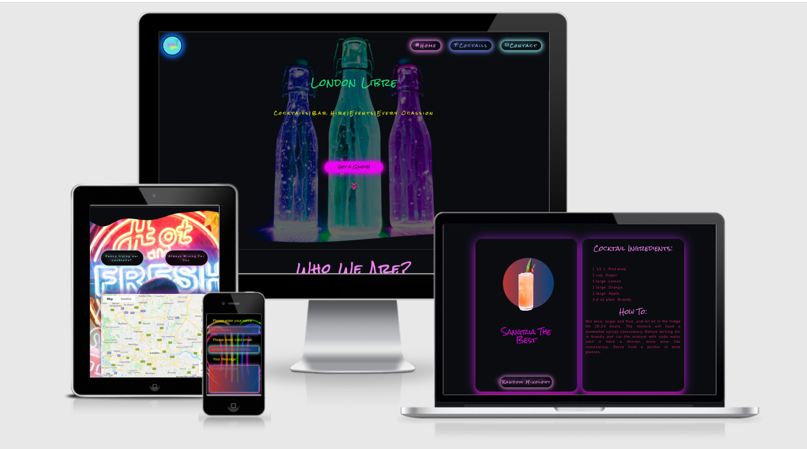

# London Libre

- Link to live website : [London Libre](https://kuzgo.github.io/project-MS2/)

---

London Libre is a small business based in London. The business owner is an experienced and awarded barman, with years of experience working and travelling around the world on cruise ships, collecting  recipes from various different parts of the globe. The business is aiming towards hiring a cocktail bar, and/or a bartender for any occasions such as weddings, corporate events etc. The business owner is also attending most of the major music festivals and offering customers an opportunity to taste the best in business cocktails in his pop-up bar. With this idea in mind, inspired with a mixture of colors, liquids, fun and neon lights as a symbol of cocktail bars as well as nights out, London Libre website design came into place. Dominant dark color has a goal to trigger a feeling of the nights out to potential users,also to define simplicity and elegance. Along with bright color combinations throughout the website the aim is to put users into a positive mood and possibly make a decision to hire a bartender. In the meantime when there are no festivals happening, the owner is brushing up his cocktail making skills in one of London's prestigious venues.

## UX

### User Stories

- User 1 : As a user I want to find the location where I can try cocktails.

- User 2 : As a user I want to ensure some of my favorite cocktails can be made before hiring.

- User 3 : As a user I want to be able to contact service provider and get a quote.

- User 4 : As a user I want to be able to connect with the bussines owner on social media.

## Existing features

- Age confirmation popup
  - Prior to landing on the homepage of the website, users are asked to confirm that their age group is in line with the law before  visiting a website whose business is making and selling alcoholic beverages.
- Navigation Bar Menu
  - Navigation bar menu is positioned on the top of the website for the user's easy navigation through the different sections of the website. The navigation bar is designed with the company logo  and three other buttons,Home, Cocktails and Contact button.
- Home
  - Home is a part of the navigation bar, it is used to bring the user to the landing/home page when clicked. Home button contains a house icon associating the user that if this option is clicked it will return them home.
- Cocktails
  - Cocktail is a part of the navigation bar, when clicked it will bring the user to the section of the page where they can check some of the cocktail recipes and how to make them .
- Contact
  - Contact is a part of the navigation bar and will bring the user to the section of the page where they will be able to contact the business owner with any questions they might have.
- Hero Image
  - Hero image of three bottles with neon lights glowing effect indicating to the users the theme of the entire website and what the website purpose is. The colors of each bottle matches the shape of the colors of three navigation bar buttons.
  - Hero image heading and informative text present to the user what the business of the owner is before they continue with browsing the website .
  - The Get Quote button is a part of the hero image section and invites potential users to contact the business owner should they want to get a quote for one of the options the business owner can offer. When this button is clicked it will bring the user to the contact section where they can make an inquiry.
  - A chewron animation is pulsing and directing the visitor of the website to scroll below and browse the website.
- Wavy banner
  - Wavy banners are implemented to the site to improve user experience and create a fluid website in an attempt to distinguish the box looking of the webpage. Each section of the website has the top and the bottom banner implemented.
- Find out more
  - Find out more text content is not displayed leaving an option to the visitor to click on the button if they intend to learn more about the businesses and the owner. Along with the text content a part of this section is a photograph of the owner which is shaped to continue with blendend and fluid effect of the entire website.
- Video
  - Video of the bartender making a cocktail will play when the visitor moves the mouse cursor over the video or  taps on touch screen devices. Along with playing the video a greenish colored frame will surround the video which will disappear when video is no longer playing, indicating whether or not the video is played.
- Map section
  - Google maps dominate this section.With the background image displaying colorful lights the aim of this feature is to remain consistent in design throughout the page.Two large buttons are positioned above maps which allow visitors to retrieve information where they will be able to taste the cocktails.
  - Button positioned on the left side provides an user with the information of what  music festivals the business owner is attending. When this button is clicked it drops the markers to the locations of the festivals in the London area.
  - Button positioned on the right side provides an user with the information of where the business owner is employed when there are no music events.
  - Map markers: Each individual marker will display the exact location on the map. When  the user hovers over the marker a little popup will show a text content 'Click for more info'. When the user clicks on the marker a window will display information of the place. A link to the official website will also be displayed which, when clicked,will be opened in a separate window.
- Cocktails
  - The Cocktail section allows users to interact with the website by using the "Random Mixology" button. This section contains two identically designed cards.
  - The first card's features are : An animated cocktail glass which will change positions and slightly rotate as soon as the user moves the mouse over this card's area.The text content  displayed below this animation is fetched from the The Cocktail DB API and represents the name of the cocktail.The Random Mixology button will on every click make a new fetch request and will render a new cocktail type to the user.
  - Once the button is clicked and  a new fetch request is sent to the Cocktails DB API,the second card will display for the user :A list of cocktail ingredients and cocktail measures.Underneath this, "How to" will provide an user with the instructions of how to make this cocktail should they wish.
- Contact form
  - Contact form is designed to remain consistent with the rest of the page. The colors selected for styling match the shapes of the image in the background. Two heading above the contact form inputs are questioning the user would they rather hire a professional if they intended to organise any kind of events. If the answer to this question is yes , then the user can contact the owner using the form provided.
  - Contact form inputs have a background gradient color used for styling the circle in the cocktail section animation. The first two input fields are required to be filled in before the form is sent, otherwise, the user would not be able to send a message. To inform the user that this occurred a little popup will be displayed reminding them to fill out all required sections.Send button is styled the same way as the two map buttons, with the idea in mind to remain consistent.The "Send" button will, when clicked, send an email to the business owner using EmailJS. After the email has been successfully sent, the user will also be notified with a message on the screen and with a no reply email also.
- Footer
  - The website footer is styled in a colorful way with a pink color which matches the "Get Quote" button from the top of the page. The features of the footer are three circle-shaped social link icons. The yellow color is also used for the labels in the contact section,maintaining consistency. Once the user hovers over them, the icons will slightly change size and background color indicating interaction. Prior to that there is a heading with the icons representing a group of people inviting the visitor to socialize. Every link to the social media will open in a separate window for user's convenience.Details of the website creator with the link to the LinkedIn which will also be open in a separate tab and the year when the site was created. As the design is based on a one-page website, the back-to-top button has been implemented which will bring the visitor back to the top of the page avoiding scrolling.
- Color scheme
  - Colour scheme has been created to represent the colours of the cocktails itself and to reflect a night out in a cocktail bar. Using my own initiative and judgement and having this in mind I wanted to create a fusion of colours and make the colour palette vibrant, and fun with neon shades witch match to the 3 bottles at the top of the home page. So I would create a unique and intuitive user experience.
    Colours used are:
  - Domiant color is `rgb(10, 12, 16)` a shade of black color which is a color of each section.
  - Home buton color is `#ee82ee`.
  - Cocktail button color is `#7690fc`.
  - Contact button as well as the first Google maps button color is `#85e6f0`.
  - Hero image header color used is `#1dea7d` which has a contrast ratio of 13.11.
  - Hero image text content color used is `#edf109` which has a contrast ratio of 17.18.
  - Get Quote button and footer section color is `#eb04ef`.
  - Headings are colored with `#ee82ee` which has a contrast ratio of 8.44.This color has also been used for the second Google maps button and contact form button.
  - Text content in the cocktails section is styled using `#e12172`.
  - Contact form label text and footer's social media icons color used is `#f7ff07` which has a contrast ratio of 19.26.
  - To style video and an image of the owner the color used is `#00ffdc`.

- Typography
  - The website fonts used are Google fonts [Rock salt](https://fonts.google.com/specimen/Rock+Salt?query=rock+salt#standard-styles) for headers.The header's  are sized quite large for easier readability and at the same time to create personal looking, almost handwriting or graffiti effect  .Google font's [Raleway](https://fonts.google.com/specimen/Raleway?query=raleway) font is used where more formal way of expressing was required , such as instructions or contact form labels.

## Features Left to Implement

## Technologies Used

- [**HTML/HTML5**](https://developer.mozilla.org/en-US/docs/Web/HTML) used for a basic structure of the page and content.
- [**CSS/CSS3**](https://developer.mozilla.org/en-US/docs/Web/CSS) used to add style to the page and its content.
- [**JavaScript**](https://developer.mozilla.org/en-US/docs/Web/JavaScript) used to add interactivity to the page and for using third party services.

## Other Technologies used:

- [**Bootstrap 5**](https://getboostrap.com) used as a framework to increase page responsivness .
- [**Google Maps API**](https://developers.google.com/maps) used for displaying maps.
- [**The CocktailDB API**](https://www.thecocktaildb.com/api.php) used as a free source for cocktail recepies.
- [**Google Dev Tools**](https://developer.chrome.com/docs/devtools/) used for developing and testing web page.
- [**Firefox Dev Tools**](https://developer.mozilla.org/en-US/docs/Tools) used for developing and testing web page.
- [**EmailJS**](https://www.emailjs.com/) used to connect users with the owner via the contact form.
- [**Get Waves**](https://getwaves.io/) used to generate SVG banners.
- [**Balsamiq**](https://balsamiq.com) used for creating a wireframe.
- [**Online Convert**](https://image.online-convert.com) used to convert photos to webp format.
- [**Google Fonts**](https://fonts.google.com) used for project fonts.
- [**Gitpod**](https://gitpod.io) used as a development environment.
- [**Canva**](https://www.canva.com) used for logo creating.
- [**Autoprefixer**](https://autoprefixer.github.io/) used to add CSS predfixes and ensure cross-browser compatibility.
- [**CSS Gradient**](https://cssgradient.io/) used for generating gradient colors.
- [**Fontawesome**](https://fontawesome.com) used for adding icons.
- [**Youtube**](https://www.youtube.com/) used as a general source of information.
- [**W3Scool**](https://www.w3schools.com/) used as a general source of information.
- [**Pexel**](https://www.pexels.com/) used to download the website's images.
- [**Pixabay**](https://pixabay.com/) used to download the website's images.
- [**Stackoverflow**](https://stackoverflow.com/) used as a general source of information.
- [**W3C Markup Validator**](https://validator.w3.org/) Used to test HTML code validation.
- [**W3C CSS Validatior - Jigsaw**](https://jigsaw.w3.org/css-validator/) Used to test CSS code validation.
- [**JSHint**](https://jshint.com/) Used to test JavaScript code validation.
- [**Am I Responsive**](http://ami.responsivedesign.is/) used during post deployment testing stage.
- [**Pixlr**](https://pixlr.com) used to remove background and editing photographs.
- [**Afinity**](https://affinity.serif.com/en-gb/photo/) used to remove background and editing photographs.
- [**Favicon generator**](https://www.favicon-generator.org/) used to generate website's favicon.
- [**Freeicons**](https://freeicons.io/technology-icons-2/asset-up-arrow-icon-19280) an arrow icon used from Raj Dev - Freeicons.

## Project Wireframe Link :

---

To see Project Wireframes please click the link: <a href="https://github.com/kuzGo/project-MS2/tree/master/assets/wireframes">Wireframes</a>

## Testing :

Click the link to see testing of the website please in a separate file:

<a href="https://github.com/kuzGo/project-MS2/blob/master/TESTING.md">TESTING.md</a>

## Deployment

## Credits :

### Content

- [**51 State Festival**](https://www.51ststatefestival.com/) Link to offical website and a part of text used in Google Maps infowindow.
- [**Kaleidoscope Festival**](https://kaleidoscope-festival.com/) Link to offical website and a part of text used in Google Maps infowindow.
- [**All Points East Festival**](https://www.allpointseastfestival.com/) Link to offical website and a part of text used in Google Maps infowindow.
- [**Junction 2 Festival**](https://www.junction2.london/) Link to offical website and a part of text used in Google Maps infowindow.
- [**Gala Festival**](https://thisisgala.co.uk/) Link to offical website and a part of text used in Google Maps infowindow.
- [**Wide Awake**](https://wideawakelondon.co.uk/) Link to offical website and a part of text used in Google Maps infowindow.
- [**Yam Carnival**](https://yamcarnival.com/) Link to offical website used in Google Maps infowindow.
- [**Hampton Court Palace Festival**](https://hamptoncourtpalacefestival.com/) Link to offical website used in Google Maps infowindow.
- [**Radio Rooftop Bar**](https://radiorooftop.com/) Link to offical website and a part of text used in Google Maps infowindow.
- [**Freeicons**](https://freeicons.io/technology-icons-2/asset-up-arrow-icon-19280) an arrow icon used from Raj Dev - Freeicons

### Code snippets :

- [**Dev Ed**](https://www.youtube.com/watch?v=XK7T3mY1V-w) Code snippet used from the video tutorial, however it was hugely refactored to fit my project needs.
- [**Bootsrap Docs**](https://getbootstrap.com/docs/5.0/components/navbar/) Code snippet used from the Bootraps documentation, however it was hugely refactored to fit my project needs.
- [**Google Developers Docs**](https://developers.google.com/maps/documentation/javascript/examples/marker-animations-iteration#maps_marker_animations_iteration-html) Used as a solution for adding `setTimeout()` to markers.
- [**WS3**](https://www.w3schools.com/howto/howto_css_custom_scrollbar.asp) code for styling a scrollbar.

### Photographers :

- Pexels :

  - [Photo by Pixabay from Pexels](https://www.pexels.com/photo/three-lighted-bottles-274131)
  - [Photo by Geraud Pfeiffer from Pexels](https://www.pexels.com/photo/glasses-of-fresh-icy-cocktails-on-marble-table-6542713/)
  - [Video by Anthony Shkraba from Pexels](https://www.pexels.com/video/bartender-making-a-drink-4485541/)
  - [Ike louie Natividad](https://www.pexels.com/photo/woman-standing-beside-led-signage-1996911/).

- Pixabay :
  - [Pixabay](https://pixabay.com/illustrations/heart-neon-color-red-neon-sign-3464049/).

## Acknowledgements
