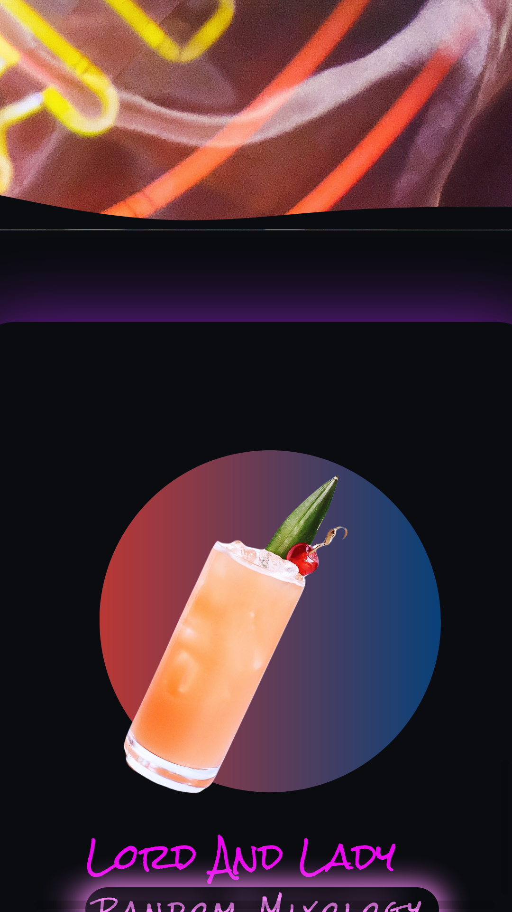
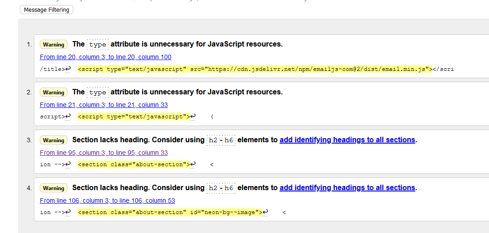
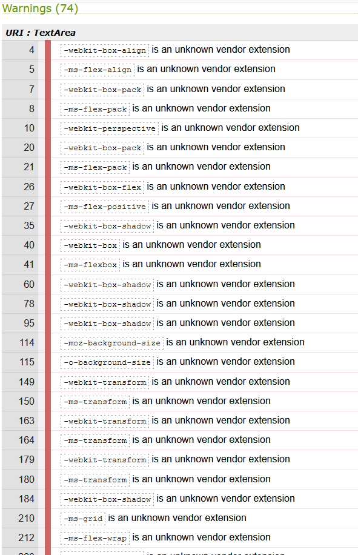
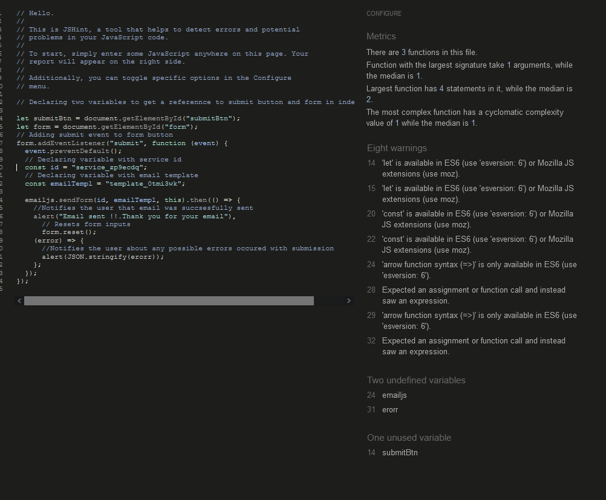
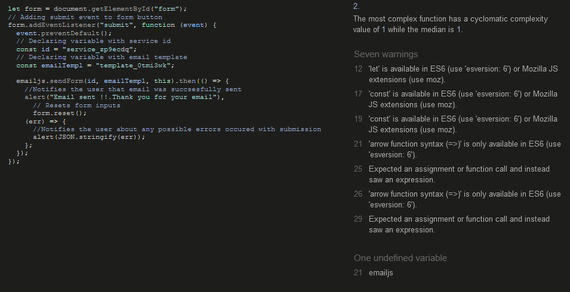

## Testing :
### Testing and debugging during the development:
At various stages of the project development I have been using extensive testing of the website. Main tools used to test the website are [**Google Dev Tools**](https://developer.chrome.com/docs/devtools/),[**Firefox Dev Tools**](https://developer.mozilla.org/en-US/docs/Tools) . To validate the code  I have been using  [**W3C Markup Validator**](https://validator.w3.org/), [**W3C CSS Validatior - Jigsaw**](https://jigsaw.w3.org/css-validator/)  and also [**JSHint**](https://jshint.com/). During the development process I encountered a certain amount of issues and bugs in the code.
- One of the first issues I came across during the early test stage was a contrast issue. This was discovered while using the Firefox Dev tool to check accessibility. This was ever since fixed by changing the color which met WCAG standards for accessible text. 

- Displaying the website properly in the landscape orientation was also one of the issues I came across. I used Dev Tool to adjust margins and paddings to center the elements in the landscape orientation. I also used `@media query` in CSS to properly render the entire page, so this issue has been fixed and the website is responsive in both portrait and landscape orientation.

- Whilst testing responsiveness, I noticed that the SVG banner is not rendering as expected, displaying a very tiny line in between the section and banner itself. I could not replicate this issue while testing a deployed site on a number of different screen size devices. If this is noticeable again it will be further developed.

- One of the major issues I encountered was a large amount of warnings coming from the Google Maps API  about non-passive event listeners. I have done research on Google and found out that it is occurring often that Maps API throws these warnings , however adding `scrollwheel:true` to the code cleared these warnings from the Console.

  - An issue with the Cocktail API rendering content in the DOM using `appendChild`. With every new fetch request sent, ingredients would be added on top of one another. As a solution I refactored the code and used template literals instead and added `break;` to the break the loop. 

### Code validation during the development:
- Code validation has been completed a number of times during the development process to ensure no errors have been found in the code. There were a few errors and warnings which mainly have been resolved.There are also some warnings which cannot be resolved as these are part of the required installation process or are required for cross-browser functionality.
- Early HTML code validation results :

- Early CSS code validation results :

The warnings displayed are due to Jigsaw's inability to validate/recognise certain CSS methods.

- Early JavaScript code validation results :

    - EmailJS code validation :

