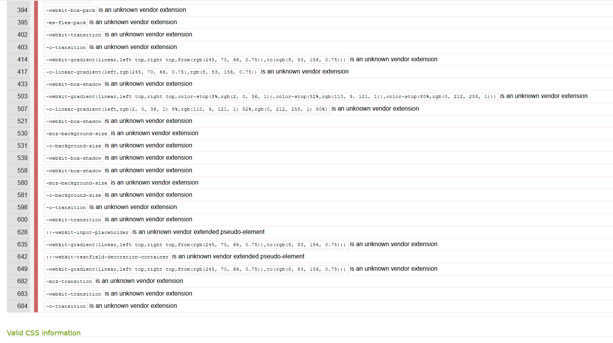

## Testing :
### Testing and debugging during the development:
---
At various stages of the project development I have been using extensive testing of the website. Main tools used to test the website are [**Google Dev Tools**](https://developer.chrome.com/docs/devtools/),[**Firefox Dev Tools**](https://developer.mozilla.org/en-US/docs/Tools) . To validate the code  I have been using  [**W3C Markup Validator**](https://validator.w3.org/), [**W3C CSS Validatior - Jigsaw**](https://jigsaw.w3.org/css-validator/)  and also [**JSHint**](https://jshint.com/). During the development process I encountered a certain amount of issues and bugs in the code.
- One of the first issues I came across during the early test stage was a contrast issue. This was discovered while using the Firefox Dev tool to check accessibility. This was ever since fixed by changing the color which met WCAG standards for accessible text. 

- Displaying the website properly in the landscape orientation was also one of the issues I came across. I used Dev Tool to adjust margins and paddings to center the elements in the landscape orientation. I also used `@media query` in CSS to properly render the entire page, so this issue has been fixed and the website is responsive in both portrait and landscape orientation.

- Whilst testing responsiveness, I noticed that the SVG banner is not rendering as expected, displaying a very tiny line in between the section and banner itself. I could not replicate this issue while testing a deployed site on a number of different screen size devices. If this is noticeable again it will be further developed.

- One of the major issues I encountered was a large amount of warnings coming from the Google Maps API  about non-passive event listeners. I have done research on Google and found out that it is occurring often that Maps API throws these warnings , however adding `scrollwheel:true` to the code cleared these warnings from the Console.

  - An issue with the Cocktail API rendering content in the DOM using `appendChild`. With every new fetch request sent, ingredients would be added on top of one another. As a solution I refactored the code and used template literals instead and added `break;` to the break the loop. 

- Issues with hero-images not rendering properly on IOS devices due to `background-attachment:fixed` which is not recognised in Safari. To fix this issue I have done a Google research and found the solution. CSS Tricks had an article on the topic : IOS devices breakpoints. From there I copied a media query code snippet which will target IOS devices in portrait and landscape orientation. I added `backgound-attacment:initial!important` to each her-image ID.This code makes images scrollable on IOS devices where Android devices still retain the parallax effect.

- Another issue with Iphone (Safari) devices was that video would not play. After researching Google I found that IOS devices need human interaction to trigger video play. The code I wrote played video on `mouseenter` `mouseout` event listeners which worked fine on most test devices. To fix that issue I added `touchstart` and `touchend` event listeners to target IOS devices.

### Code validation during the development:
- Code validation has been completed a number of times during the development process to ensure no errors have been found in the code. There were a few errors and warnings which mainly have been resolved.There are also some warnings which cannot be resolved as these are part of the required installation process or are required for cross-browser functionality.
- Early HTML code validation results :

- Early CSS code validation results :

The warnings displayed are due to Jigsaw's inability to validate/recognise certain CSS methods.

- Early JavaScript code validation results :

    - EmailJS code validation :

- Results received for undefined variable emailjs are due to mandatory process of installation and EmailJS implementation , based on that variable will have to remain as is in order to be functionable.

- app.js (where custon JavaScript code is stored) early results
  - One unused variable warning has been fixed by refactoring the code.

 

- Google maps code validation :
 - There are a couple of warnings shown but these are due to Google specific variables required in order for Google Maps API implementation and will remain the same.
initMap function is part of the `
  `

- Cocktails.js code validation :
 - cocktails.js code has been validated showing no errors. The warnings displayed in this image are cleared by adding `/*jshint esversion: 6 */` at the top of JSHint.

 

- Lighthouse reports ran for both mobile and desktops:

  - Lighthouse mobile devices report:

  

  - Lighthouse desktop devices report:

 

 ### Testing of finalized version of the website:
 --- 
  - Results of JavaScrit code validation:

  

  

   

   

   - Results of CSS code validation:
      - Code shows no errors.Note: Warnings are due to prefixes added using Autoprefixer to ensure cross-browser compatibility.     

   <a href="assets/docs/css-final-test.pdf" target="_blank" >Link to CSS Validation PDF Document</a>

   

  - Results of HTML code validation:

    - Code shows no errors.Warnings are due to JavaScript  code inside `<script>`  tag which was copied from official documentation in order for code to work.

     <a href="assets/docs/html-final-doc.pdf" target="_blank" >Link to HTML Validation PDF Document</a>

      

### Lighthouse reports of deployed website:
---
  - Lighthouse mobile desktop  report:

  

  - Lighthouse desktop mobile report:

  

### User stories testing :

- User 1 : As a user I want to find the location where I can try cocktails.
  - I was able to navigate to the map and when I clicked one of two buttons it showed me the exact location where I could try cocktails, both during the festival season and off season.

   

- User 2 : As a user I want to ensure some of my favorite cocktails can be made before hiring.
  - I wanted to ensure that the bartender could make my favorite cocktail before making the decision to hire him.While browsing the site I found some cocktail recipes where I could see how my favorite cocktail Bloody Punch is made.

- User 3 : As a user I want to be able to contact service providers and get a quote.
 - As soon as I landed on the main page I found the "Get Quote" button. However, I wanted to browse site content before making the decision to contact the business owner. I was able to find the contact form and send my request.

 

 

- User 4 : As a user I want to be able to connect with the business owner on social media.
  - I was able to find links to the owners social media accounts and connect with them to find out more about the business before hiring them.

### Functionality testing :

 - As part of functionality testing the developer tested every part of the website to ensure that everything is working properly on different types of devices and screen sizes: 
 - Navigation bar:
 1. Once hovering over navigation bar links,the buttons will change the size, button's background will become darker and the color slightly change around the Home, Cocktails, and Contact links.
 2. When the Cocktails button is clicked, the page will smoothly scroll the content and bring the user to the sections with some random cocktail recipes .
 3. When the Contact button is clicked, the page will smoothly scroll the content and bring the user to the sections where the business owner can be contacted .

 - Homepage/Hero image:

 1. Heading clearly indicates to the user what the business of the owner is , and what services they can provide.
 2. When the Get Quote button is clicked, the page will smoothly scroll the content and bring the user to the sections where the business owner can be contacted .

 - Who We Are: 
1. When the plus button positioned next to the "Find out more" is clicked the text content will smoothly and slowly appear providing information about the business and business owner.
2. Once clicked the plus button will rotate,indicating to the user that the text content will remain visible until they decide otherwise by clicking the button.

- Watch me mixing: 

1. When the user hovers over the video on their desktop,the video will be  playing the content with the bartender demonstrating how the cocktails are made.On mobile devices, the user will be able to play the video by touching the screen.Decision to whether or not watch the video is left to the user to decide,without automatically playing the video they might not want to watch.
2. Along with playing the video, the color will surrounding the video will change, indicating that the video is being played.

- Google map:

1. When Fancy Trying our cocktails? is hovered over it will change the text content to Music Festivals, showing that this button will give the locations of the music 
festivals. 
2. When Always Mixing for you  is hovered over it will change the text content to Off Season, showing that this button will give the locations of the place where cocktails can be consumed while there are no festivals.
3. Once the button is clicked, it will display custom markers on the map with different locations, along with scrolling the page slightly, focusing the user's attention to the map. 
4. When each marker is clicked it will display information of the festival with the link to the official website.

- Or try it yourself: 

1. A text followed with the animation clearly explaining to the user that if they decide not to visit any of the locations where they can try cocktails, they could try to make one themselves by using the owner's recipes.
2. When hovered over the card while navigating to the button, the cocktail glass will rotate, simulating pouring the drink.
3. When Random Mixology is clicked it will display the Cocktail name, and on the second card a list of measurements, ingredients and instructions.

- Contact form:
1. Contact form cannot be submitted unless Your name and/or Your email input sections are not filled in.

2. Once filled out and sent, the user will be notified that the email was sent.

3. The owner will receive the user's message in their inbox.

4. The user will receive a confirmation email.

5. The form input fields will be cleared once the query is sent.

- Footer :

1. Footer consists of three links to social media platforms.
2. Each button will change a background color and size when hovered over.
3. Each link will open in a separate window.
4. Details with the webpage creator with the link to LinkedIn opened in a separate tab.
5. Animated back-to-top button will when hovered change the color and when clicked shoothly scroll to the top of the webpage.